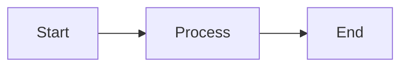

# MD → HTML Converter

A single-file Markdown to HTML converter designed for formatting LLM outputs for Word, Quip, and Google Docs.

🌐 **[Try it live](https://peelizulfein.github.io/mdtohtml)** — no install needed


## The Problem

You're working with ChatGPT, Claude, Gemini, or another LLM. You get great output in markdown format. Now you need to put it in a Word doc, Quip page, or Google Doc for your team.

**The old way:**
1. Save as `.md` file
2. Install pandoc
3. Run `pandoc input.md -o output.docx`
4. Open Word, copy content
5. Paste into your doc
6. Fix formatting issues
7. Manually delete "Here's the table you asked for:" filler

**The new way:**
1. Paste markdown
2. Click 🧹 Cleanup (removes LLM filler)
3. Click 📋 Copy
4. Paste into your doc ✨

No pandoc, no command line, no data leaving your machine.

## Features

- **🧹 LLM Cleanup** — Auto-strips "Here's what you asked for:" and other conversational filler
- **📄 Word/Excel Mode** — Copies with inline styles for perfect table borders in Microsoft Office
- **📊 Mermaid Diagrams** — Renders flowcharts, sequence diagrams, etc. as images for PowerPoint
- **📋 One-Click Copy** — Rich text that pastes with formatting preserved
- **✏️ Editable Preview** — Click to edit the output before copying
- **🌓 Dark/Light Mode** — Toggle for comfortable editing
- **📁 Drag & Drop** — Drop `.md` files directly onto the editor
- **💾 Save HTML** — Export as standalone HTML file
- **🔒 100% Local** — Single HTML file, works offline, no server needed

## Zero-Install Deployment

This is a **single HTML file**. No npm, no build step, no dependencies to install.

```bash
# Option 1: Clone and double-click
git clone https://github.com/peelizulfein/mdtohtml.git
open mdtohtml/index.html

# Option 2: Just download index.html
# Double-click to open in any browser

# Option 3: Use the hosted version
# https://peelizulfein.github.io/mdtohtml
```

Perfect for locked-down corporate laptops where you can't install software.

## Workflow

```
┌─────────────┐     ┌─────────────┐     ┌─────────────┐
│   LLM       │ ──▶ │  MD→HTML    │ ──▶ │  Word/Quip  │
│  (markdown) │     │  Converter  │     │  (formatted)│
└─────────────┘     └─────────────┘     └─────────────┘
```

1. Generate markdown from your LLM
2. Paste into the left pane (or drag your `.md` file)
3. Click **🧹 Cleanup** to remove LLM filler text
4. Optionally edit the preview on the right
5. Click **📋 Copy** (or **📄 Word** for Office docs with tables)
6. Paste into Word, Quip, Google Docs, or PowerPoint

## Copy Buttons Explained

| Button | Use Case |
|--------|----------|
| **📋 Copy** | General purpose — works for Quip, Google Docs, Notion |
| **📄 Word** | Microsoft Word — copies with inline styles for proper formatting |
| **📊 Excel** | Export tables to .xls file (only appears when tables exist) |
| **🔤 Code** | Raw HTML code — for developers or embedding |

## LLM Cleanup

The 🧹 Cleanup button removes common LLM filler phrases:

- "Here's the table you requested:"
- "Sure! Below is..."
- "I've created the following..."
- "Let me know if you need anything else!"
- "Hope this helps!"

One click strips the fluff, leaving just the content.

## Mermaid Diagrams

LLMs frequently generate Mermaid diagrams. This tool renders them visually:

````markdown

````

The diagram renders as an SVG that you can copy and paste into PowerPoint or other tools.

## Supported Markdown

| Element | Syntax |
|---------|--------|
| Headers | `#`, `##`, `###`, etc. |
| Bold | `**text**` |
| Italic | `*text*` |
| Lists | `-` or `1.` |
| Code | `` `inline` `` or fenced blocks |
| Tables | GFM style |
| Blockquotes | `>` |
| Links | `[text](url)` |
| Images | `` |
| Task lists | `- [ ]` or `- [x]` |
| Mermaid | ` ```mermaid ` |

## Hosting Your Own (GitHub Pages)

1. Fork this repo
2. Go to **Settings** → **Pages**
3. Set source to **main branch** / **root**
4. Your converter is live at `https://peelizulfein.github.io/mdtohtml`

Free hosting, automatic HTTPS, zero maintenance.

## Privacy & Security

Everything runs in your browser. Your markdown **never leaves your machine**.

- No backend server
- No analytics or tracking
- No cookies
- External requests only load libraries (marked.js, DOMPurify, mermaid.js) on first load

Perfect for confidential documents and enterprise use.

## Contributing

PRs welcome! Some ideas:

- [ ] Syntax highlighting for code blocks
- [ ] Custom CSS themes for output
- [ ] Keyboard shortcuts (Cmd+Enter to copy)
- [ ] PWA support for true offline use
- [ ] Browser extension
- [ ] Export to DOCX directly

## License

MIT — Do whatever you want with it.
