# Project Status Report

## Overview
The **MD → HTML Converter** is a lightweight tool for converting LLM outputs into formatted documents.

## Feature Comparison

| Feature | Status | Priority |
|---------|--------|----------|
| Markdown Parsing | ✅ Complete | High |
| LLM Cleanup | ✅ Complete | High |
| Word/Excel Export | ✅ Complete | Medium |
| Mermaid Diagrams | ✅ Complete | Medium |
| Dark Mode | ✅ Complete | Low |

## Architecture

```mermaid
flowchart LR
    A[📝 Markdown Input] --> B[Parser]
    B --> C{Content Type}
    C -->|Text| D[HTML Renderer]
    C -->|Diagram| E[Mermaid.js]
    D --> F[📄 Rich Output]
    E --> F
    F --> G[📋 Copy to Clipboard]
```

## Key Benefits

- **Zero install** — just open the HTML file
- **Privacy first** — nothing leaves your browser
- **LLM optimized** — strips filler text automatically

> "Paste markdown, click copy, paste into docs. Done."

## Next Steps

1. Add syntax highlighting
2. Build browser extension
3. PWA offline support
